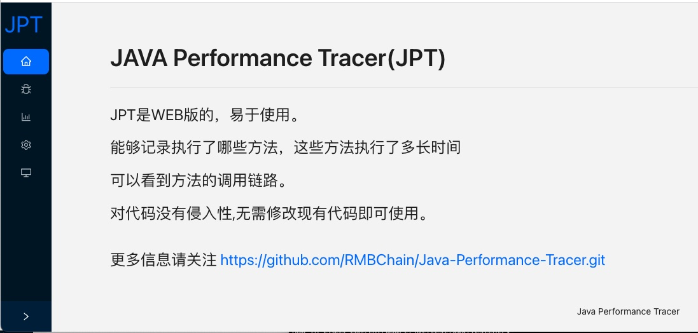
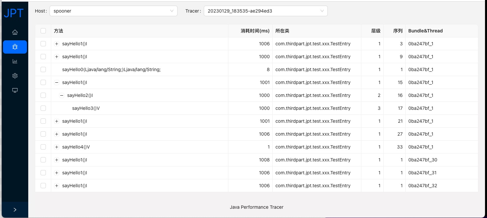
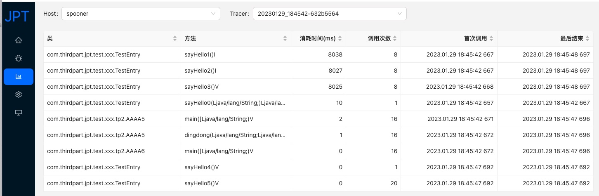
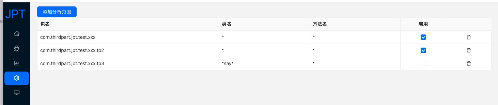

# Java Performance Tracer

>JPT is designed for cloud services and is suitable for microservice performance analysis.

>WEB version, easy to use.

>Be able to record the methods that were executed and how long they were executed. And you can see the call link of the method.

>It is non-invasive to the code and can be used without modifying existing code.

# Prepare Env
- MongoDb
- Maven 
- JDK8

# Configure Env and Run
- 1. [Dev Env](tutorial/Env_DEV.md)
- 2. [使用K8S运行](tutorial/Env_K8S.md)

 
# Module Description
|  模块             |  说明  |
|  ----            | ----  |
| jpt-agent        | 用于在启动JVM时向方法的开始和结束中注入字节码,以记录方法运行的开始和结束时间 |
| jpt-common       | 一些通用信息 |
| jpt-collector    | 用于将记录的方法开始和结束信息发送到 jpt-ui-backend |
| jpt-ui-backend   | 接受 jpt-collector 发送的信息，并提供web服务 |
| jpt-ui-frontend  | 前端UI画面 |
| jpt-tester       | 提供的测试工程，可以产生一些demo信息 |

# Technology Stack
- ASM
- SpringBoot
- Mongo
- Java Agent
- NIO
- React
- Ant Design

# 后续完善
- Feature 1
- Feature 2

# Useful link
- ASM https://asm.ow2.io/
- AntD React https://ant.design/docs/react/introduce
- AntD Chart https://charts.ant.design/
- MongoDB  https://www.mongodb.com/
- Spring Boot https://spring.io/projects/spring-boot

# com.spotify: java code to image
- https://github.com/spotify/dockerfile-maven
- https://blog.csdn.net/zhouyygyxk/article/details/90511027
