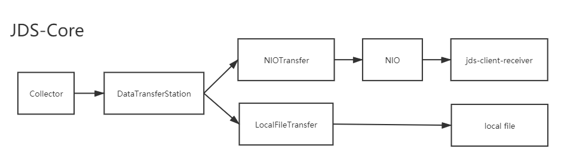

# Java Dynamic Snapshot : jds-core

##请使用jds-core-tester来测试本工程

##需要设置的环境变量

> jds\_client\_receiver\_server : default localhost

> jds\_client\_receiver\_port: default 9999

##配置文件说明

>### persistenceTarget.saveDataToLocal= true

>将数据保存到本地（$user_home/.jds目录下）。

>### persistenceTarget.saveDataToRemote=false

>将数据保存到远程,需要同时设置jds\_client\_receiver\_server和jds\_client\_receiver\_port

##日志保存位置：$user_home/.jds/log

##打包命令

> cd C:\\\_minirmb\_\JavaDynamicSnapshot_workspace\jds\jds-core

> mvn clean install

