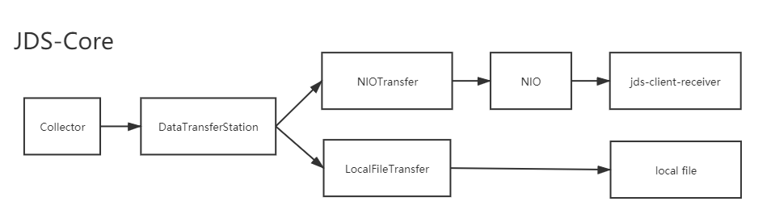

# Java Performance Tracer : jps-core



# 原理
在类加载器加载.class字节码时，使用asm在方法之前和之后加入记录时间的字节码。

使用方法
```
set      baseDir=C:\project\Java-Dynamic-Snapshot
set     agentJar=%baseDir%\jps-core\target\jps-core-1.0.8-SNAPSHOT.jar
set      testJar=%baseDir%\jps-core-tester\target\jps-core-tester-1.0.8-SNAPSHOT.jar
set configFolder=%baseDir%\jps-core-tester\workspace

cd %baseDir%
java -javaagent:%agentJar%=%configFolder% -cp  %testJar% com.thirdpart.jds.test.JDS_CoreTester_Application
```

配置说明
```
server=localhost:9999

includedClass=com.thirdpart.jps.test.xxx.TestEntry  # 说明
excludedClass= com.otherparty.Colors  # 说明

excludedPackage=com.otherparty.ddd.measure  # 说明
includedPackage=com.thirdpart.jps.test.xxx.tp1  # 说明
includedPackage=com.thirdpart.jps.test.xxx.tp2  # 说明
includedPackage=com.thirdpart.jps.test.xxx.tp3  # 说明
```

优先级： includedClass > excludedClass > excludedPackage > includedPackage

excludedPackage 和 includedPackage 不包含它们的子包。

# 入口
com/minirmb/jps/TransformEntry.java

## 使用jps-core-tester来测试本工程

##需要设置的环境变量

> jds\_client\_receiver\_server : default localhost

> jds\_client\_receiver\_port: default 9999

##配置文件说明

>### persistenceTarget.saveDataToLocal= true

>将数据保存到本地（$user_home/.jds目录下）。

>### persistenceTarget.saveDataToRemote=false

>将数据保存到远程,需要同时设置jds\_client\_receiver\_server和jds\_client\_receiver\_port

##日志保存位置：$user_home/.jds/log


##打包命令

> cd C:\\\_minirmb\_\JavaDynamicSnapshot_workspace\jds\jds-core

> mvn clean install


